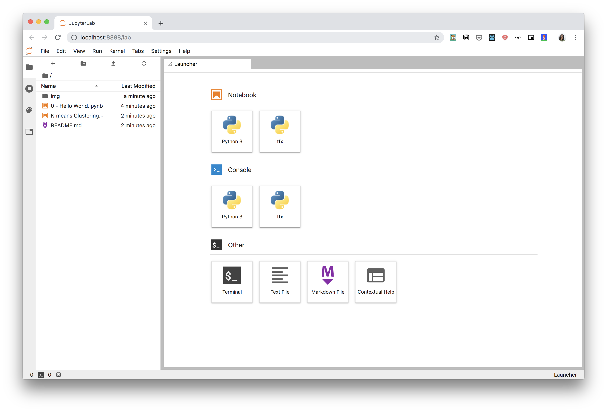

# Learn JupyterLab

This repository contains notebooks to getting started and familiar with [JupyterLab](https://jupyterlab.readthedocs.io/en/stable/index.html), the next generation of Jupyter Notebook.

## Installation

- Install Git -- [see here](https://help.github.com/en/articles/set-up-git).
- Install Python, preferably Python 3 -- [see here](https://www.python.org/downloads/).
- Install Jupyter, preferably using Pip -- [see here](https://jupyter.org/install).
- Install JupyterLab, preferably using Pip -- [see here](https://jupyterlab.readthedocs.io/en/stable/getting_started/installation.html#pip).

## Getting Started

Clone this repository:

```bash
git clone https://github.com/airlab-unsri/learn-jupyterlab.git
```

Go to the newly created directory:

```bash
cd learn-jupyterlab
```

Run JupyterLab server:

```bash
jupyter lab
```

You will see these logs about JupyterLab server on your terminal:

```bash
[I 21:04:16.720 LabApp] JupyterLab extension loaded from /usr/local/lib/python3.7/site-packages/jupyterlab
[I 21:04:16.720 LabApp] JupyterLab application directory is /usr/local/share/jupyter/lab
[I 21:04:16.723 LabApp] Serving notebooks from local directory: /Users/ariefrahmansyah/go/src/github.com/airlab-unsri/learn-jupyterlab
[I 21:04:16.723 LabApp] The Jupyter Notebook is running at:
[I 21:04:16.723 LabApp] http://localhost:8888/?token=20fd890925c91e823f2a3da3e9b4acc122784a0584a354d3
[I 21:04:16.723 LabApp]  or http://127.0.0.1:8888/?token=20fd890925c91e823f2a3da3e9b4acc122784a0584a354d3
[I 21:04:16.723 LabApp] Use Control-C to stop this server and shut down all kernels (twice to skip confirmation).
```

It will then open your browser:


